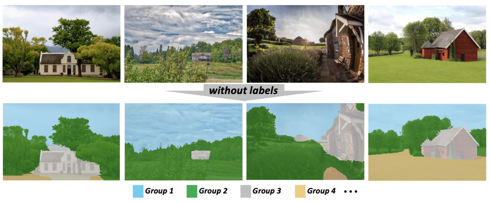
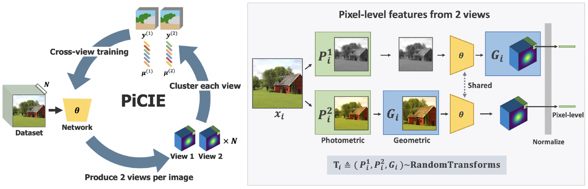

# Understanding SSL by implementing PiCIE.
PiCIE Unsupervised Semantic Segmentation using Invariance and Equivariance in Clustering: 
[[paper](https://openaccess.thecvf.com/content/CVPR2021/papers/Cho_PiCIE_Unsupervised_Semantic_Segmentation_Using_Invariance_and_Equivariance_in_Clustering_CVPR_2021_paper.pdf)]

  

  

## Setup
Setting up for this project involves installing dependencies and preparing the datasets. 

### Installing dependencies
To install all the dependencies, please run the following:
~~~
conda env create -f env.yml
~~~

### Preparing Dataset 
Please download the [trainset](http://images.cocodataset.org/zips/train2017.zip) and the [validset](http://images.cocodataset.org/zips/val2017.zip) of COCO dataset as well as the [annotations](http://calvin.inf.ed.ac.uk/wp-content/uploads/data/cocostuffdataset/stuffthingmaps_trainval2017.zip) and the [json files](http://images.cocodataset.org/annotations/annotations_trainval2017.zip). Place the dataset as following:
~~~
/your/dataset/directory/
      └── coco/
            ├── images/
            │     ├── train2017/
            │     │       ├── xxxxxxxxx.jpg
            │     │       └── ...
            │     └── val2017/
            │             ├── xxxxxxxxx.jpg
            │             └── ...
            └── annotations/
                  ├── train2017/
                  │       ├── xxxxxxxxx.png
                  │       └── ...
                  ├── val2017/
                  │       ├── xxxxxxxxx.png
                  │       └── ...
                  ├── COCO_2017_train.json
                  └── COCO_2017_val.json
~~~
Then, create a symbolic link as following:
~~~
cd PiCIE
ln -s /your/dataset/directory/ datasets 
~~~
Similarly, setup a symbolic link for the save directory as following:
~~~
ln -s /your/save/directory/ results
~~~
Finally, move *curated* folder and *fine_to_coarse_dict.pickle* file to *datasets/coco/*:
~~~
mv curated datasets/coco/
mv fine_to_coarse_dict.pickle datasets/coco/
~~~
This will setup the dataset that contains the same set of images with [IIC](https://github.com/xu-ji/IIC/blob/master/code/datasets/segmentation/cocostuff.py) ([config](https://github.com/xu-ji/IIC/blob/master/examples/commands.txt)).

## Running PiCIE 
Below are training and testing commands to train PiCIE. 
### Training
Below line will run the training code with default setting in the background. 
~~~
nohup ./sh_files/train_picie.sh > logs/picie_train.out & 
~~~
Below line will run the testing code with default setting in the background. 
### Testing 
~~~
nohup ./sh_files/test_picie.sh > logs/picie_test.out &
~~~

## Pretrained Models 
We have pretrained PiCIE weights. 
|Method|Dataset    |Pre-trained weight             | Train log                |
|:----:|:---------:|:-----------------------------:|:------------------------:|
|PiCIE |COCO       |[weight](https://drive.google.com/file/d/1VI5detMlDNkwWpv7M-gk7aAHgfQVebWo/view?usp=sharing)|[log](https://github.com/janghyuncho/PiCIE/blob/master/logs/picie.out)  |
|MDC   |COCO       |[weight](https://drive.google.com/file/d/1NzQQ4u__nz5xh-_zOFi_DPOHW6Gv_nbm/view?usp=sharing)|[log](https://github.com/janghyuncho/PiCIE/blob/master/logs/mdc.out)  |

## Visualization 
We prepared [a jupyter notebook](visualize.ipynb) for visualization.

## Homework

## Point 1
Review the code and try to understand the connection between the code and the paper. Then run the train file and save the results.
In the report, identify and explain where in the code is the generation of the pseudo-tags. 

Also discuss:
- Why they have used a Siamese architecture?
- Why the clusters generated have semantic meaning?

## Point 2
Modify the code in a way that only 2 transformations (1 of color, 1 of geometrics) can be aplied to images. Then run the train file and save your results.

In your report, describe the changes that you did and compare them with the baseline. It has a better performance? Which transformations are already implemented? What is the implication of using 2 or more transformations? Try to relay the paper to the response.

## Point 3

## Point 4

Change hyperparameters of the training process in order to get

## Point 5

